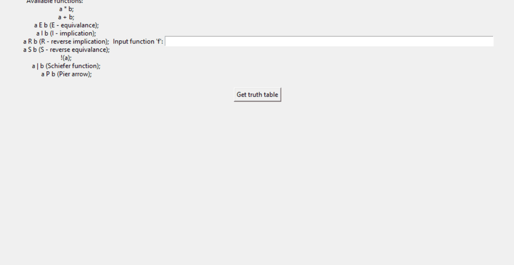

# Truth-table
## Creates truth table for boolean functions
### Developed for research needs

**In use**

**Syntax restrictions**

*Use single-letter variables*

*Keep whitespaces before and after variables*

